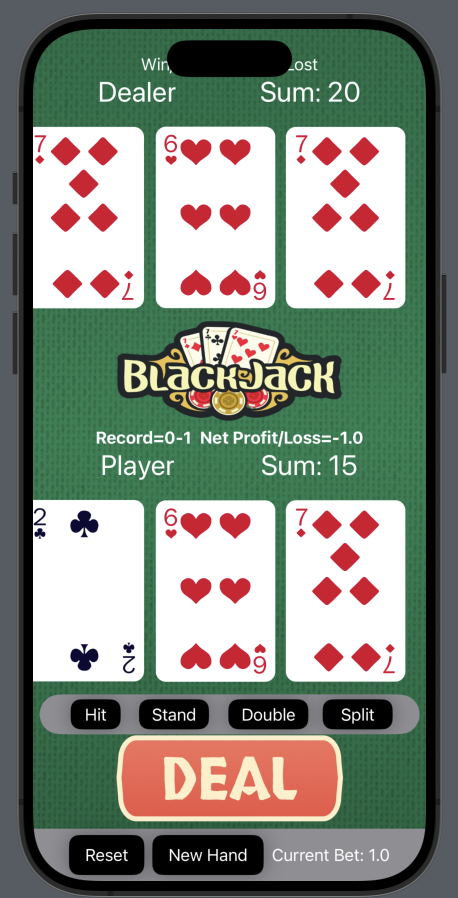
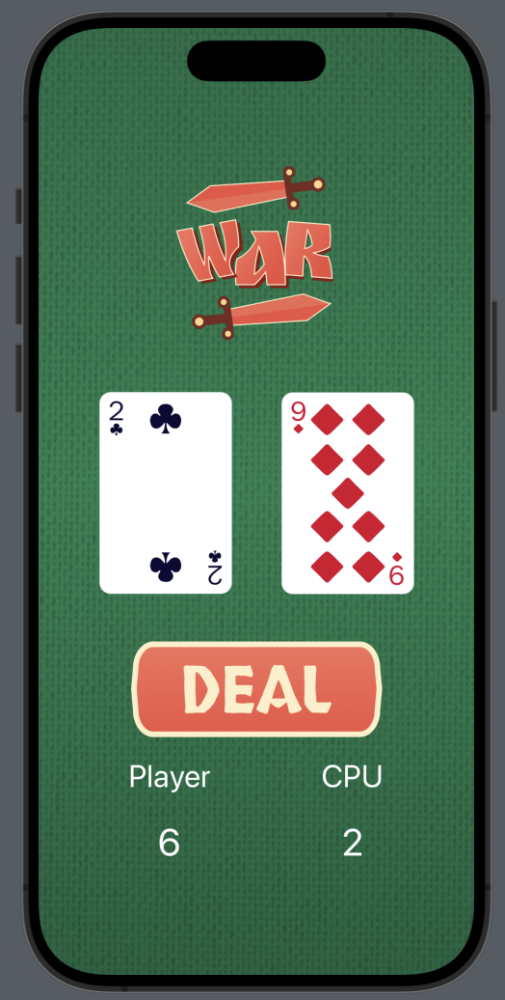

# iOS Mini-Games Repository

## Overview

Welcome to the iOS Mini-Games Repository. This collection of mini-games showcases popular games built using SwiftUI. Each game within this repository incorporates different aspects of iOS development with SwiftUI.
### Games Included

- **Blackjack**: An implementation of the classic card game where the goal is to beat the dealer by getting a count as close to 21 as possible without going over.
    - [Learn more about Blackjack](Blackjack/BlackjackReadme.md)
- **War Game**: A card game based on the tutorial by CodeWithChris, where players draw cards and the higher card wins a point.
    - [Learn more about War Game](WarGameDemo/WarReadme.md)

## Screenshots

Below are screenshots from the games included in this repository:

| Blackjack       | War Game        |
|-----------------|-----------------|
|  |  |


## Installation

### Device/Software Versions Used

- MacOS Ventura 13.6
- Xcode 15.2
- Swift 5
- iOS 16.0 or newer on your testing device or simulator(only tested on iPhone 15 base, plus, pro, and pro max model)


### Cloning the Repository

Clone the repository and navigate into the directory of the game you wish to run:

```bash
git clone https://github.com/IsaacAnderson1/iOSMinigames.git
cd iOSMinigames
```

## Acknowledgments

- Special thanks to [CodeWithChris](https://codewithchris.com) for the tutorials that inspired some of these games.

## Contact

Isaac Anderson - ianderson7596@gmail.com
